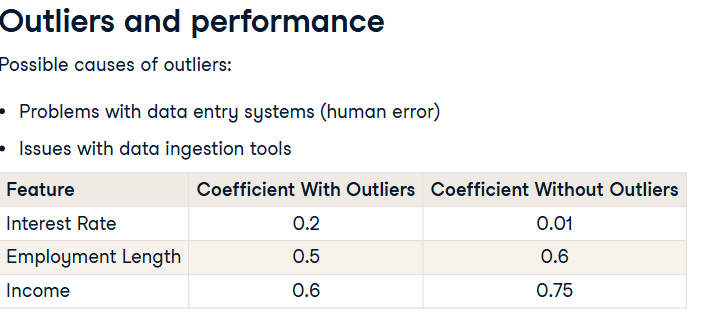

# Outliers in Credit Data

Type: class
Course: Credit Risk Modeling in Python (Credit%20Risk%20Modeling%20in%20Python%20228e0f71ffdc80b7bc79e2d13be31878.md)
Done: Done

---

<aside>

ABOUT

- Outliers in Credit Data
</aside>

- Data processing: this is important as we want our models to predict defaults correctly as often as possible.
    - outlier detection: data entry systems producing bad data is fairly common. with outliers in our training data, our predictive models will have a difficult time estimating parameters like coefficients. This can cause our models to not predict as many defaults.
    
    
    
    One way we can detect outliers, is to use **cross tables** with aggregate functions. Another way to detect them is to use **visuals**. 
    
    - removal: we can easily use the .”drop()” method to remove rows from our data.