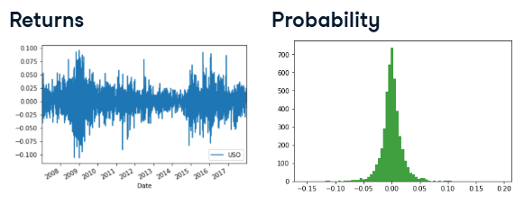

# Financial returns

Type: class
Course: Introduction to Portfolio Risk Management in Python (Introduction%20to%20Portfolio%20Risk%20Management%20in%20Pytho%2022ee0f71ffdc80e1b72bebdad253123f.md)
Date: 2025년 7월 12일
Done: Done

---

<aside>

ABOUT

- how to analyze return distributions
- how to build portfolios
- how to identify factors driving portfolio returns + estimate potential losses
</aside>

- Investment risk
    - financial risk
        - a measure of the uncertainty of future returns.
        - Dispersion or variance of financial returns.
        - it hinges on(depends on) two fundamental concepts: returns and probability.
        
        
        
    - ways of measuring risk
        - standard deviation or variance of daily returns
        - kurtosis of the daily returns distribution
        - skewness of the daily returns distribution
        - historical drawdown
    - A tale of two returns
        - Returns are derived from stock prices and are expresses as percentages in decimal form.
            - Discrete returns(simple returns): it represents periodic(e.g., daily, weekly, monthly, etc.) price movements.
            
            
            
            - Log returns: it is often used in academic research and financial modeling. they assume continuous compounding.
            
            
            
            ** log returns aggregate across time, while discrete returns aggregate across assets. since you are building portfolios with multiple assets, discrete returns make the most sense to work with for this course. 
            
    - Calculating stock returns in Python
        - Load in stock prices data and store it as a pandas DataFrame organized by date:
        
        
        
        - calculate daily returns of the adjusted close prices and append the returns as a new column in the DataFrame.
        
        
        
    - Visualizing return distributions
        - 
        
        