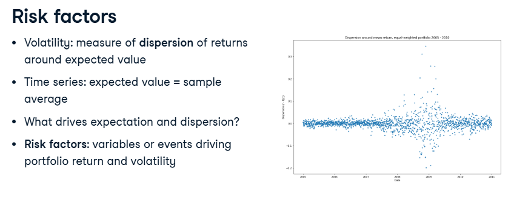

# Risk factors and the financial crisis

Type: class
Course: Quantitative Risk Management in Python (Quantitative%20Risk%20Management%20in%20Python%2023ee0f71ffdc80a88b40e5c4037cadd6.md)
Done: Done

---

<aside>

ABOUT

- Risk factors and the financial crisis
</aside>

- Risk factors: quantifying risk involves:
    - Volatility: a measure of the dispersion of portfolio returns around an expectation of what the returns will be, taking the sample average return as the expectation.
        
        
        
        what variables or events will affect the expectation and the dispersion of returns? such variables or events are known as the risk factors of a portfolio. 
        
- Risk exposure: a measure of possible portfolio loss due to return volatilty. (like how much loss you **could** suffer because you’re exposed to some kind of risk.). In a portfolio, this means how sensitive your investment is to different risk factors
    - Risk factors determine risk exposure.
    
    
    
    - Deductible = Fixed amount you pay yourself when a loss occurs, no matter what even if your flood insurance covers 100% of damages, you still pay the deductible out of pocket.
- Systemic risk: risk factor(s) affecting volatility of all portfolio assets.
    - market risk: systematic risk from general financial market movements
    
    
    
- Idiosyncratic risk: risk specific to a particular asset/asset class.

- Factor models
    - Factor model is assessment of risk factors affecting portfolio return.
    - it uses a statistical regression, often Ordinary Least Squares (or OLS), to regress returns (or returns volatility) on risk factors.
    
    
    

- Crisis factor model
    - Factor model regression: portfolio returns vs mortgage delinquency
    
    
    

** MBS (Mortgage-Backed Securities)

- mortage: a loan to buy a house. the borrower repays it monthly (principal + interest) over many years.
- Security: a financial product that people can invest in.